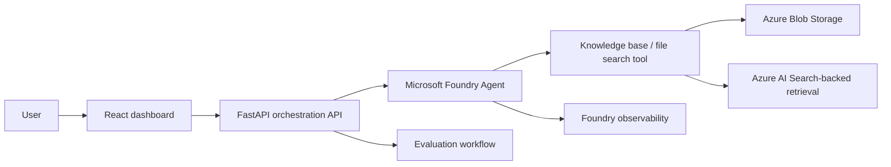

# Architecture Overview

The project is a GenAIOps support copilot built around Microsoft Foundry Agents.

## Target Architecture

## Local Development Architecture

Local development uses a mock agent and markdown knowledge files. This preserves the API contract and UI behavior while Azure resources are prepared.

## Key Boundaries

- Frontend owns user workflow and operational visibility.
- Backend owns API contracts, local adapters, and cloud provider integration.
- Foundry Agent owns model reasoning, tool use, and grounded response generation in the target architecture.
- Knowledge base/file search owns retrieval over curated source documents.
